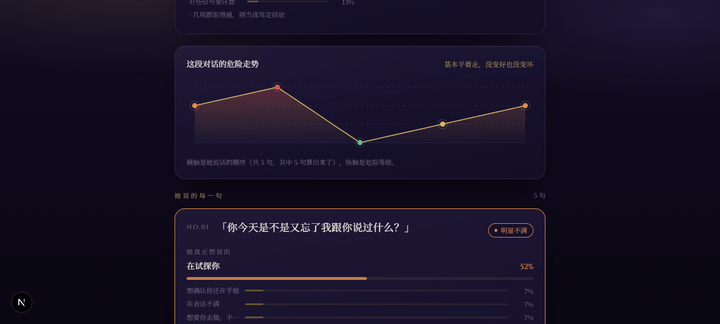
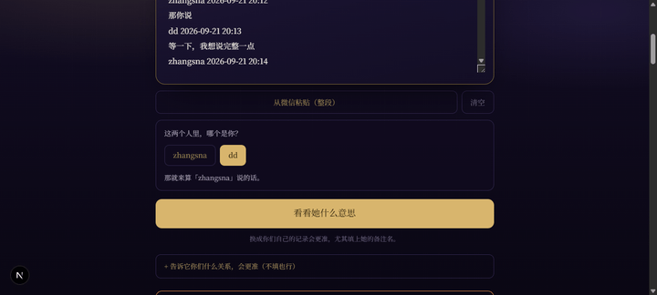
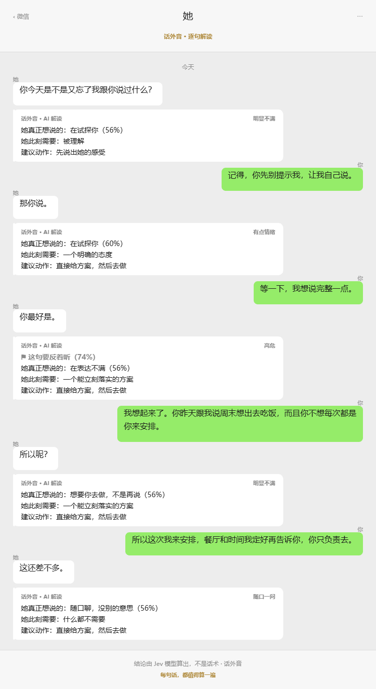

# 话外音 · Between the Lines

> 她说「随便」、「没事」、「你最好是」的时候，心里在想什么。
> 把聊天记录贴进来，**她说的每一句都给你算一遍**。

[](https://deploy.workers.cloudflare.com/?url=https://github.com/leslieyin/Between-the-Lines)

逐句给出**真实意图概率**、**她此刻需要什么**、**危险等级**、**建议动作**，
再算一条整段对话的危险走势，并能一键生成一张能直接发朋友圈的聊天截图。

<p>
  
  
</p>



---

## 它和「让大模型帮你分析」有什么不同

结论由 **Jev**（TypeSafe 的 System One 模型）算出来，而 Jev **只打分，不写字**。

所有可能的答案都提前枚举在 `src/features/analyze/prompts.ts` 里 ——
「在确认在乎 / 在表达不满 / 想要你去做 / 在试探你 / 想要被哄 / 在划底线 / 随口聊 / 说不准」，
模型只负责给每个选项算一个概率。这意味着：

- **它编不出一个不存在的结论。** 不会像自由生成的模型那样，为了把话说圆而虚构一个动机。
- **它只能算，不能陪你聊。** 它不是聊天机器人，也不会安慰你。
- **低置信度会如实说出来。** 几个选项都说得通的时候，界面会写「几项都说得通，别当成笃定结论」，
  而不是把概率最高的那项包装成答案端出去。

一句话：这是一个**概率工具**，不是一个会说话的算命先生。

---

## 快速开始（本地）

前置：Node.js 20+，以及一个 TypeSafe API Key（<https://typesafe.ai>）。

```bash
npm install

cp .dev.vars.example .dev.vars
# 打开 .dev.vars：
#   填上 TYPESAFE_API_KEY
#   或先什么都不填、保持 DEMO_MODE=true —— 界面/交互/截图/历史/分享全链路都能跑，
#   只是那些数字是按固定规则生成的样例，不是 Jev 算的（页面上会有橙色提示条）

npm run dev          # http://localhost:3000
```

本地**不需要装数据库**：`next dev` 会通过 wrangler 启动一个本地 D1（SQLite 模拟），
表结构在第一次请求时自动创建，数据落在 `.wrangler/`（已 gitignore）。

---

## 部署到 Cloudflare

### 方式一：一键部署按钮

点上面的 **Deploy to Cloudflare** 按钮。Cloudflare 会：

1. 把仓库克隆一份到你自己的 GitHub 账号
2. 让你在设置页确认 Worker 名字、资源名，并填写 `TYPESAFE_API_KEY`
3. 用 Workers Builds 构建并部署，**自动创建并绑定 D1 数据库**（会读 `wrangler.jsonc` 里的声明）

密钥是从 `.dev.vars.example` 里识别出来的 —— 那个文件里只留 `TYPESAFE_API_KEY` 一项需要填。

### 方式二：本地命令行

```bash
npx wrangler login     # 只要一次
npm run deploy:local
```

`npm run deploy:local` 会自动：

1. 读 `.dev.vars` 里的 `TYPESAFE_API_KEY`（没有就跳过上传，改用控制台配置）
2. 检查登录状态
3. 确认 D1 数据库存在（不存在就创建），把**真实的** `database_id` 写进
   `wrangler.local.jsonc` —— 这个文件已 gitignore，**仓库里那份 `wrangler.jsonc` 保持占位值**
4. 有 Key 就上传为 Worker secret
5. 清理上次构建产物 → 构建 → 部署 → **自动请求一次线上 `/api/ready`**，
   当场告诉你数据库接没接上、模型配置就绪没就绪、是否误落在演示模式

> **为什么要拆成两份 wrangler 配置**：`database_id` 是账号专属的，写进开源仓库会让别人
> 点部署按钮时指向一个不存在的库；但本地部署又必须要有真实 id。一个文件满足不了，
> 所以真实 id 放本地那份，`scripts/cf.mjs` 检测到它就带 `--config` 指过去。

### 绑自定义域

在 `.dev.vars` 里加一行，然后照常部署：

```bash
CUSTOM_DOMAIN=your-domain.com
```

`npm run deploy:local` 会把它写成一条 `routes`，写进 **gitignore 掉的 `wrangler.local.jsonc`** ——
Cloudflare 会自动建 DNS 记录和证书。域名需已托管在同一个账号下。

> **为什么不直接写在 `wrangler.jsonc` 里**：域名是账号专属的。写死在提交进仓库的那份配置里，
> 别人点部署按钮时 Cloudflare 会试图把一个不属于他的域名挂上去，部署当场失败。
> 仓库里那份就把 `routes` 注释掉了，只在本地这份里注入。

> **为什么要绑**：`*.workers.dev` 在国内 DNS 被污染（解析到境外大厂的 IP 段），
> 部署成功但打不开。只在境外访问的话不用管这一段。

### 密钥也可以只在控制台配

`.dev.vars` 里的 Key 只是为了自动化上传，**不是必需的**：

> Workers & Pages → 选你的 Worker → Settings → **Variables and Secrets** →
> **Runtime variables and secrets** → 添加 `TYPESAFE_API_KEY`，类型选 **Secret**。

- 控制台改完**即生效，不需要重新部署**。
- 注意作用环境：Production / Preview 的变量是分开的。
- **别在线上配 `DEMO_MODE=true`。** 那样界面一切正常但数字不是算的 ——
  部署脚本和运行日志都会提示这一条。
- `.dev.vars` 里有值时，`npm run deploy:local` 会**覆盖**控制台那份。想让控制台说了算，就把文件留空。

---

## Windows 用户注意：不要直接调 `opennextjs-cloudflare build`

统一用 `npm run cf:build` / `npm run cf:deploy`（`deploy:local` 内部也走这两个）。
原因是踩到一个 Node 在 Windows 上的静默失败：

> **`fs.cpSync` 递归复制时，只要目标路径含非 ASCII 字符，就一个文件都不复制、也不报错。**

实测（Node 22 / Windows）：目标为 ASCII 正常；目标为 `中文目录` 时复制 0 个文件；
同一路径下 `fs.copyFileSync` 单文件正常。

`@opennextjs/aws` 的 `initOutputDir()` 恰好用 `fs.cpSync` 把编译好的 `open-next.config.mjs`
搬进 `.open-next/.build`；目标为空之后，下一步 `createMiddleware()` 找不到
`open-next.config.edge.mjs`，构建会在 `Bundling middleware function...` 处 ENOENT 崩掉。

所以 `scripts/cf.mjs` 用 `node --require scripts/fix-cpsync.cjs` 预加载一个补丁，
把 `cpSync` 换成用 `copyFileSync` 实现的等价递归复制，**仅在目标路径含非 ASCII 时接管**，
只在构建进程内生效。路径全是 ASCII 的环境下它等于不存在。

另外两点：

- 构建前如果 `.open-next` 已存在，先删掉再构建（某些环境下的目录清理会卡住）。
- 构建成功与否不要看 `worker.js` 的时间戳，看 `.next/BUILD_ID` 与
  `.open-next/assets/BUILD_ID` 是否一致。

---

## 它怎么工作

```
粘贴的聊天记录
   │
   ├─ ① 解析：切句 + 认说话人（支持「她：」「昵称 12:00」两种微信格式，多行消息会合并）
   │      微信导出的记录常常是两个真实昵称，认不出哪个是你 → 让用户点一下（存本机复用）
   │
   ├─ ② 逐句送 Jev（每 4 句合并进一个请求，批间并发受控）
   │      每句 6 个判断：
   │        是否需要解读 (Noul) · 是否需要反着听 (Noul)
   │        真实意图 (Choice×8) · 她此刻需要 (Choice×7)
   │        危险等级 (Score×4) · 建议动作 (Choice×7)
   │
   ├─ ③ 整段再问一次：关系位置 (Choice×5) · 气氛走势 (Score×5) · 今天只做一件事 (Choice×6)
   │      （带上②算出的逐句危险等级作为辅助数据，让「走势」有据可依）
   │
   └─ ④ 汇总：翻牌卡片 + 走势图 + 微信截图 + 分享短链 + 历史记录
```

**为什么每 4 句合并成一个请求**：整段对话会随每个问题重复发给模型，但请求数从「句数」
降到「句数 / 4」。在 Workers 的 CPU 预算和上游限流面前，这个差别是决定性的。

**单批失败不拖垮整体**：某批重试耗尽仍失败时，那几句标成「没算出来」，其余照常展示。
宁可看到 12 句结论 + 4 句没算出来，也不要整页报错。

---

## 目录结构

```
src/
├─ app/                        # 路由（App Router）
│  ├─ page.tsx                 # 主页面
│  ├─ history/                 # 历史记录
│  ├─ s/[slug]/                # 分享页
│  └─ api/                     # 控制器层：只解析请求、调服务、格式化响应
├─ components/                 # 展示组件
├─ features/analyze/           # 这个产品的核心
│  ├─ prompts.ts               # ★ Jev 的问题与选项定义（改产品行为先看这里）
│  ├─ parse.ts                 # 聊天记录解析 + 说话人识别
│  ├─ service.ts               # 编排：分批提问、汇总、部分失败容忍
│  ├─ judgment.ts              # 把 Jev 答案收敛成领域对象
│  └─ presentation.ts          # 颜色 / 文案 / 分享配文的唯一来源
├─ lib/
│  ├─ typesafe/client.ts       # ★ Jev 类型化客户端（问题类型 → 答案类型的编译期映射）
│  ├─ api-client.ts            # 浏览器侧 API 封装（4xx 不重试、5xx 重试 3 次、配置缺失不重试）
│  └─ wechat-shot.ts           # 纯前端 canvas 生成聊天截图
└─ server/
   ├─ config.ts                # ★ 环境变量唯一入口，惰性校验
   ├─ errors.ts                # 类型化错误体系
   ├─ http.ts                  # 统一响应 / 全局错误处理 / 设备标识
   ├─ rate-limit.ts            # 基于 D1 的滑动窗口限流
   └─ db/                      # 仓储层：唯一碰 SQL 的地方
```

技术栈：**Next.js 15（App Router） + React 19 + TypeScript + Tailwind v4**，
经 **@opennextjs/cloudflare** 部署到 **Cloudflare Workers**，数据存 **Cloudflare D1**。
没有 UI 组件库、没有状态管理库、没有 ORM —— 全部手写，依赖很少。

---

## 接口

| 方法 | 路径 | 说明 |
| --- | --- | --- |
| POST | `/api/analyze` | 一次完整分析。体 `{ raw, herName?, youAre?, relation?, extra? }` |
| GET | `/api/analyses` | 本设备的历史列表 |
| DELETE | `/api/analyses` | 清空本设备全部历史（并换发设备标识） |
| GET / DELETE | `/api/analyses/:id` | 取回 / 删除单条 |
| POST | `/api/analyses/:id/share` | 生成（或取回）分享短链，幂等 |
| GET / PUT | `/api/profile` | 关系背景档案（她是谁、什么关系、最近发生了什么） |
| GET | `/api/health` | 存活探针，不碰数据库 |
| GET | `/api/ready` | 就绪探针，分别报告配置与数据库状态 |

统一响应：成功 `{ ok: true, data }`，失败 `{ ok: false, error: { code, message, requestId } }`。
任何未捕获异常都会被全局错误处理器兜住，**不会把堆栈返回给客户端**。

---

## 几个刻意的设计决定

**从微信复制的记录里，先问「哪个是你」。**
微信导出的记录，说话人往往就是两个真实昵称（`gaoo 12:00` / `Leslie 12:01`）。
解析器能看出这是两个人在说话，但**没有任何办法知道哪个是用户本人**。
所以解析分两遍：第一遍只认「谁在说话」，第二遍才按 `youAre` 定性。
界面上就是两个可点的昵称按钮 —— 让人点一下，比让他手打一遍昵称可靠得多。
指认结果存在本机 localStorage，且**每次都要校验它属于当前这段对话**：
对不上就当作没选并清掉。否则换一段聊天后，旧名字会让解析器把两个无关的人都当成「她」。

**危险等级用四格台阶，不用百分比。**
危险不是连续量。画成 73% 会让人以为多算一位小数就多一分准确，
而模型真正回答的问题是「处在第几档」。

**分批提问，不是一句一问。** 见上文。

**数据默认留在本机。**
记录按设备（httpOnly cookie）隔离。点「一键清空」时会连设备标识一起换掉 ——
旧数据不只是从列表消失，而是彻底断开归属。

**分享链接只靠 slug 的熵来保护。** 约 60 bit，猜不出来等于看不见。
分享页不返回她的备注名和关系背景，拿到链接的人只需要看见结论。

**截图在浏览器里画。** 生成聊天截图用的是前端 canvas：聊天记录本来就不该为了生成一张图
再往服务器发一次，而且 Workers 上也跑不了 headless 浏览器。

---

## 环境变量

全部在 `src/server/config.ts` 集中校验，缺失或非法立刻报错，不会带病运行。
`.dev.vars` / `.dev.vars.example` 只影响本地；线上的运行时变量来自 Cloudflare。

**取值的优先级是「Cloudflare 运行时绑定 > `process.env`」，顺序不能反。**
原因是踩过的坑：`next build` 会把构建当时 `process.env` 里的值**快照进服务端 bundle**
（`.env.local` 里非 `NEXT_PUBLIC_` 的变量也会被带进去）。所以如果优先读 `process.env`，
那么在本机跑过一次构建之后，`.env.local` 里的 `DEMO_MODE=true` 会一路渗进线上 ——
Cloudflare 控制台里配好了 Key，线上却仍在返回演示数据，而且界面上看不出任何异常。
这也是本项目**用 `.dev.vars` 而不是 `.env.local`** 的原因：前者由 wrangler 读取、
经绑定进入运行时，不会被 `next build` 快照。

完整清单见 `.dev.vars.example`。最常改的几个：

| 变量 | 默认 | 作用 |
| --- | --- | --- |
| `TYPESAFE_API_KEY` | 必填 | Jev 密钥，只在服务端使用 |
| `DEMO_MODE` | `false` | 不调真实模型，用内置样例跑通界面 |
| `ANALYZE_MAX_ANALYZED_LINES` | `16` | 一次最多翻多少张牌，直接决定耗时与成本 |
| `ANALYZE_GROUP_SIZE` | `4` | 每个 Jev 请求合并几句 |
| `RATE_LIMIT_PER_HOUR` | `20` | 每设备每小时可分析次数 |

线上的非敏感项来自 `wrangler.jsonc` 的 `vars`；改密钥用
`npx wrangler secret put TYPESAFE_API_KEY` 或在控制台改。
随时打开 `/api/ready` 能确认线上读到的到底是哪一档配置。

---

## 数据表

由 `src/server/db/client.ts` 的 `ensureSchema()` 在首次请求时幂等创建，不需要手动跑迁移。

- `analyses` —— 一份分析快照（输入 + 结果 JSON + 分享 slug）
- `profiles` —— 关系背景档案，按设备一条
- `rate_events` —— 限流计数，24 小时自动清理

---

## 自查

```bash
npx tsc --noEmit                                  # 类型
npm run dev                                       # 另开一个窗口
node scripts/smoke.mjs http://127.0.0.1:3000      # 35 项接口冒烟
```

冒烟覆盖：探针 / 分析 / 历史 / 分享幂等 / 404 / 非法 JSON / 限流边界 / 清空 /
以及说话人指认的三个分支（没指认 → 422 带候选、指认后只算对方、指认对不上 → 当作没指认）。

---

## 免责

这东西算的是概率，不是真相。它不知道你们之间发生过什么，
它只是把「旁边一个很擅长看人脸色的人会怎么想」量化了一下。
照着做之前，先相信你自己的判断。

它也不替任何人做决定，更不构成任何形式的心理咨询或建议。

---

## License

[MIT](LICENSE)

